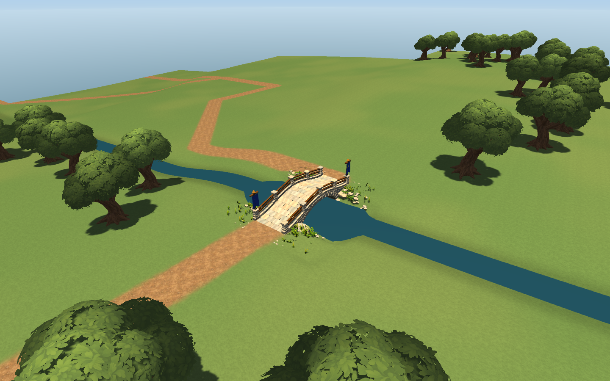
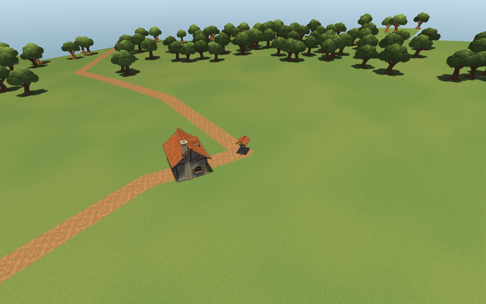

# Concept pass1–5: desktop integration

Branch: `codex/concept-world-pass-2026-10-09`; base97856fe after reviewed Chat
PR26–30. Isolated concept only: Main/shared shaders/original production library
are unchanged. This is a first usable visual baseline, **not finished graphics**.

## Implemented

- Saved concept settings now explicitly enable strict realized-road connectivity
  and at least one fixed bridge; invalid routing fails bootstrap instead of silently
  returning a bad plan. Existing endpoint/stale-link fixes remain in force.
- Default-off bounded natural river fallback: concept cap24 candidates, hard32;
  same downhill tracer/flow/width pipeline, no fabricated river on flat terrain.
- Concept carving uses maximum valid segment profile envelope around bends;
  legacy nearest-segment behavior remains unchanged when disabled.
- Real finite `concept_slice`32×32chunks/1024m, seed−10101,2-player scene:
  `Assets/_Game/Scenes/ConceptProceduralWorld.unity`. No authored chunk meshes in
  that scene; `WorldStreamer` builds and streams the actual generated world.
  The2-player setting is not evidence of multiplayer balance/start fairness.
- Real meadow/dirt/soil/stone textures, normal/AO for the reviewed path texture,
  isolated sky/day/sunset/night lighting. No invented PBR maps for meadow.
- Oak/rock references replace only concept visual placeholders. Original art
  intake remains untouched. Shared resource/ruin placeholders are not accepted
  production assets and are intentionally not disguised as finished content.
- Ground-checked village presenter:3 deterministic candidate house slots/well;
  only playable streamed terrain support, all samples ready before placing,
  unsafe slope/spread rejected, bounded waiting, prefab scale preserved.
  Actual first village accepted1 house + well, not a complete3–5-house settlement.
- Tree-only crown clearance5m from road edge in concept: resources/grass masks
  and Main unchanged. Entrance crops no longer obscure the bridge in the close view.
- Measured107.856ms worst terrain-surface stage prompted a default-off local
  road/river segment broad phase. It scans the macro segment list once per chunk,
  then tests local expanded AABBs and exact geometry; no persistent full-world index.
- Concept generationVersion2→3 explicitly records changed generation settings;
  existing saves are not silently claimed compatible. Main version unchanged.

## Portable art and actual preflight

The existing TerrainStarter library is deliberately Git-ignored; committing its
GUIDs directly would break a fresh clone. `ConceptRuntimeArtKit` copies only34
approved runtime dependencies into tracked `Art/Imported/ConceptWorldKit_v001`.
Approximately40.7MB including metadata, not the complete local art library.
`Provenance.json` records exact source paths/GUIDs/SHA256 and new runtime GUIDs.
Only copied YAML GUID references are remapped; original FBX/PNG/materials are not
modified. Dependency validation rejects links back into ignored art/Ready folders.

Actual Unity Oak/House validators:0errors/0warnings. Oak separate Leaves/Trunk,
UV0/normals present; Leaves_LOD0 vertices3240/tri2880, no VertexColors required
for the separated mesh. Oak total LODtri12068/6858/3106. COMPATIBLE technically;
moving close/far shadow/shimmer acceptance remains pending.

House LODtri143672/55764/22794: technical validity is **not** an acceptable art
performance budget. GitHubQ17 is a separate measured authored-LOD intake gate.
House support half-extents derive from its real root BoxCollider+0.1m padding,
not an assumed3.5m footprint. Detailed foundation/entrance masks are futureQ10/Q11.

## Evidence and acceptance

Full Unity6000.5.5f1 EditMode: **175/175 PASS**,20.589s,0failures/skips.
PlayMode: **5/5 PASS**,9.855s,0failures/skips. Includes synthetic physics tests
for3 supported house slots and refusal to use a decorative mesh as ground;
those tests are not screenshots or proof of arbitrary generated village layouts.

Saved-source-only audit at1024m+384mhalo, without roads/bridges:
12345→1 fallback river/1949ms;54321→1 fallback/646ms;
−10101→2 ordinary/2006ms;777→1 fallback/763ms.
Fallback is not proof that every river crosses the playable region or gives a
compatible bridge. The actual runtime scene additionally verifies an inside-map
fixed bridge and strict realized-route satisfaction.

Pre-broadphase observed worst stage
`07_TerrainSurface`107.856ms,49active chunks,191cached across caches,
9terrain colliders,1accepted village house,2rivers/2fixedsites/35roads.

Final real Play after broadphase+portable kit:49active chunks,201cached across
caches,9terrain colliders,1accepted house;2rivers/2fixedsites/35roads;
strictRoutes=True. Worst stage now `02_RiverTerrainCarving`77.224ms;
lastMesh0.405ms/lastSpawn0.413ms. Surface is no longer the worst stage, but
this is **not** a per-stage matched benchmark or a60FPS pass. Remaining carving
spike gets futureQ18; macro bootstrap also remains synchronous.

Committed evidence: `concept-pass-1-5-evidence/` contains EditMode/PlayMode XML,
actual preflight/source audit logs, runtime.txt and four final GPU PNGs.
Fresh clone dependency graph is closed against ignored art, but a separate
fresh-checkout Unity/Player launch has not been run.

Runtime GPU captures use actual Play, strict route satisfaction and a fixed bridge
inside playable bounds (halo-only sites do not qualify). Real clock-driven12:00,
18:00,00:00 frames plus a generated-village view. No Blender/baked fixture used.
The first failed attempt exposed null scene WorldDefinition references; those
were repaired, builder resolves the asset again after NewScene, and regression
tests verify saved persistent references. Empty diagnostic frames are excluded.

No Player FPS claims. Stage timing is from Editor Play on this desktop, one seed,
one small map. Cached chunks combine caches; the configured per-cache limit is
not a verified total-memory budget. No large repeated seed matrix was run.

## What is still unfinished in stages1–5

1. Reliable maps: bounded failure/source policy exists, but arbitrary seed/size,
   playable-region crossings, exits, buildability and start fairness still need
   the separately budgeted acceptance matrix. Logical graph is not unit navigation.
2. Live scene: real and reproducible; camera walk/revisit/finite edges/Player
   capture still need acceptance. It is not a full-world scenery release.
3. Earth/nature: coarse terrain and textures work, but water is flat, roads are
   angular, broad lawns lack groundcover presentation, banks/outcrops/flowers are
   sparse. Root did not pretend data-only grass density renders grass geometry.
4. Village/light: first supported structures and night readability work, but a
   composed village, entrances, walls/gates and budgeted warm windows/lamps remain.
5. Performance: local surface bottleneck addressed; macro startup still blocks,
   house is too dense, total cache/forest/LOD/GPU budgets and quality tiers are open.

Future implementation queue:18 scoped Sol6High tasks, issues31–47 + existing
bootstrap issue5. See `docs/tasks/chat-world-graphics-queue-2026-10-09.md`.
Start independently with Q01 (macro stepping), Q10 (data footprints), Q17 (house
budget audit); avoid concurrent ownership of streamer/catalog/terrain shader.

